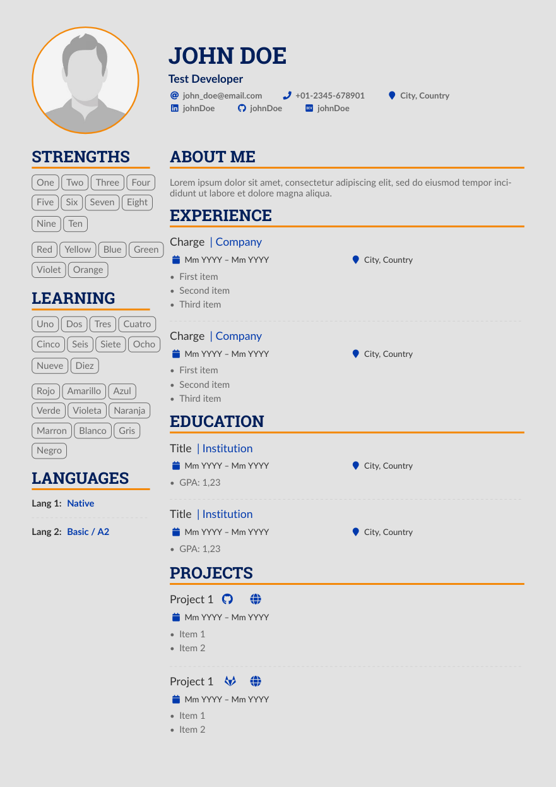

# Primary Orange CV

A [Craftadoc](https://craftadoc.com) template. (Using LaTeX.)

Side bar with tags and orange highlighting, ideal for developers.

### How do I use this?

#### Option 1:

Directly use the template in your browser using Craftadoc [here!](https://app.craftadoc.com/template/overview/63663175b057b8f7721f5e41) And fill in the template using the automatically generated UI. This is the easiest option.

#### Option 2:

Open the source code in Overleaf: visit [the template page](https://app.craftadoc.com/template/overview/63663175b057b8f7721f5e41), select the gear icon in the top right and select `Open in Overleaf`.

#### Option 3:

Clone this repository and use your favorite latex compiler locally. (This template uses XeLatex.)

## Example:

## Source:
Original template:
https://www.overleaf.com/latex/templates/altacv-nicolasomar-fork/htfpmrwhbwpw

### Changes:
* Added Craftadoc input markers.
* Small command changes.

### License
[LaTeX Project Public License 1.3c](https://www.latex-project.org/lppl/lppl-1-3c.txt)